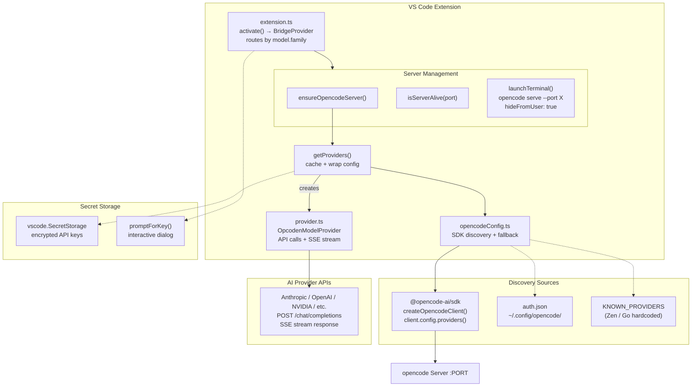
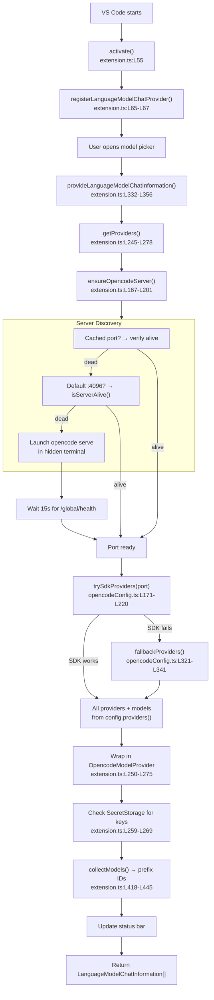
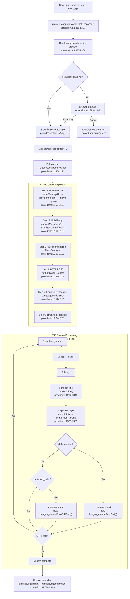

# Architecture — OpenCode Provider Bridge

A VS Code extension that brings all [opencode](https://opencode.ai)-configured AI providers (Anthropic, OpenAI, Google, NVIDIA, Vultr, Zen, Go, etc.) into VS Code's Chat model picker so you can use them alongside GitHub Copilot or as your primary chat models.



---

## 1. Entry Point — `package.json`

The extension manifest tells VS Code about our extension:

| Field | Purpose |
|---|---|
| `"type": "module"` (line 8) | ESM — allows direct `import` of `@opencode-ai/sdk` |
| [`activationEvents`](package.json#L60-L62) | `onLanguageModelChatProvider:opencode-provider-bridge` — VS Code activates us lazily |
| [`contributes.languageModelChatProviders`](package.json#L25-L32) | Registers vendor ID `"opencode-provider-bridge"` |
| [`contributes.commands`](package.json#L33-L58) | 6 commands: refresh, status, add/remove/list providers |
| [`dependencies`](package.json#L71-L73) | `@opencode-ai/sdk` — static top-level import (ESM) |

---

## 2. Extension Activation — `src/extension.ts`

**VS Code Lifecycle** ([source](src/extension.ts#L14-L30)):

```mermaid
flowchart LR
    A["VS Code starts"] --> B["reads package.json"]
    B --> C["activate() — registers BridgeProvider"]
    C --> D["User opens model picker"]
    D --> E["ensureOpencodeServer()<br/>:4096 or launch headless"]
    E --> F["provideLanguageModelChatInformation()"]
    F --> G["User picks a model + sends message"]
    G --> H["provideLanguageModelChatResponse()"]
    H --> I{"hasApiKey?"}
    I -->|No| J["promptForKey()<br/>interactive dialog"]
    J -->|Key given| K["store in SecretStorage + retry"]
    J -->|Declined| L["LanguageModelError"]
    I -->|Yes| K
    K --> M["delegate to OpencodeModelProvider"]
    M --> N["update status bar with token usage"]
```



### Functions & APIs

| Function | Lines | Role | Called By |
|---|---|---|---|
| [`activate()`](src/extension.ts#L55-L147) | L55-L147 | Registers `BridgeProvider` + 6 commands + status bar | VS Code on startup |
| [`deactivate()`](src/extension.ts#L148-L162) | L148-L162 | Disposes headless server terminal, clears cache | VS Code on shutdown |
| [`ensureOpencodeServer()`](src/extension.ts#L167-L201) | L167-L201 | Returns active port: cached → check default :4096 → launch headless | `getProviders()` |
| [`isServerAlive(port)`](src/extension.ts#L203-L210) | L203-L210 | Pings `/global/health` endpoint | `ensureOpencodeServer()` |
| [`launchTerminal()`](src/extension.ts#L212-L237) | L212-L237 | Runs `opencode serve --port <random>` in hidden terminal | `ensureOpencodeServer()` |
| [`getProviders(context)`](src/extension.ts#L245-L278) | L245-L278 | SDK via server → fallback → wrap in `OpcodenModelProvider` | `BridgeProvider` methods |
| [`showStatus()`](src/extension.ts#L287-L315) | L287-L315 | Notification with provider + model counts | Command handler |

### Commands

| Command | Lines | Effect |
|---|---|---|
| `refreshModels` | [L69-L78](src/extension.ts#L69-L78) | Clears cache + server port, fires change event |
| `showStatus` | [L82-L85](src/extension.ts#L82-L85) | Shows notification with provider counts |
| `setApiKey` | [L89-L92](src/extension.ts#L89-L92) | (legacy) Delegates to showStatus |
| `addProvider` | [L95-L111](src/extension.ts#L95-L111) | Interactive prompt: enter provider ID + API key, stores in SecretStorage |
| `removeProvider` | [L114-L125](src/extension.ts#L114-L125) | QuickPick → select → delete from SecretStorage |
| `listProviders` | [L128-L140](src/extension.ts#L128-L140) | Shows all configured providers with model counts |

---

## 3. BridgeProvider — `src/extension.ts` (class)

The `BridgeProvider` (L317) implements `vscode.LanguageModelChatProvider` and acts as a **router**: one provider VS Code sees, delegates to the correct `OpcodenModelProvider` based on `model.family`.

### VS Code LM Provider API — 3 Required Methods

| Method | Lines | What VS Code Passes | What We Return / Do | When Called |
|---|---|---|---|---|
| `provideLanguageModelChatInformation()` | [L332-L356](src/extension.ts#L332-L356) | `{ silent: boolean }` + `CancellationToken` | `LanguageModelChatInformation[]` | Model picker opens |
| `provideLanguageModelChatResponse()` | [L358-L407](src/extension.ts#L358-L407) | `model`, `messages[]`, `options` (tools), `progress`, `token` | `void` — streams via `progress.report()` + updates status bar with token count | User sends chat message |
| `provideTokenCount()` | [L409-L416](src/extension.ts#L409-L416) | `model`, `text`, `token` | `number` — char-based estimation | Token budget display |

### Private Helpers

| Helper | Lines | What It Does |
|---|---|---|
| `collectModels()` | [L418-L445](src/extension.ts#L418-L445) | Iterates sub-providers, prefixes IDs (`anthropic/claude-sonnet-4`), sets `family` for routing |
| `promptForKey()` | [L383-L406](src/extension.ts#L383-L406) | Shows dialog "Needs API key → Enter Key" → stores in SecretStorage |

### Key Design Decisions

- **Silent mode** ([L334-L336](src/extension.ts#L334-L336)): When `options.silent`, return cached models without refreshing
- **Key prompting on use** ([L368-L381](src/extension.ts#L368-L381)): If `!provider.hasApiKey`, show dialog ONLY when user tries to chat — not on startup
- **Token status bar** ([L394-L403](src/extension.ts#L394-L403)): After each response, shows `$(hubot) OpenCode | 452→123 (575) tok`
- **Error wrapping** ([L410-L414](src/extension.ts#L410-L414)): Non-`LanguageModelError` exceptions wrapped with `new LanguageModelError()`
- **Zen/Go key sharing** ([L259-L266](src/extension.ts#L259-L266)): If `opencode-go` has no key, uses `opencode` key (same for vice versa)
- **Server cleanup** ([L148-L162](src/extension.ts#L148-L162)): `deactivate()` disposes the hidden terminal

---

## 4. Provider Discovery — `src/opencodeConfig.ts`

Three-tier discovery: SDK → models.dev + auth.json → bare fallback.

### Types

| Type | Lines | Description |
|---|---|---|
| `ProviderCredential` | [L39-L43](src/opencodeConfig.ts#L39-L43) | API key or OAuth token |
| `OpcodenAuth` | [L45-L47](src/opencodeConfig.ts#L45-L47) | `Map<providerId, ProviderCredential>` |
| `ModelsDevModel` | [L49-L59](src/opencodeConfig.ts#L49-L59) | Model metadata + `apiUrl` (exact endpoint from SDK registry) |
| `ModelsDevProvider` | [L62-L69](src/opencodeConfig.ts#L62-L69) | Provider metadata |
| `ProviderEntry` | [L72-L76](src/opencodeConfig.ts#L72-L76) | Combined: provider + credential + models |

SDK types `Provider` and `Model` are imported directly from `@opencode-ai/sdk` (line 30-31).

### Constants

| Constant | Lines | Description |
|---|---|---|
| `KNOWN_PROVIDERS` | [L92-L97](src/opencodeConfig.ts#L92-L97) | Hardcoded endpoints for Zen (`opencode.ai/zen/v1`) and Go (`opencode.ai/go/v1`) |

### Tier 1 — SDK Discovery (Preferred)

| Function | Lines | What It Does |
|---|---|---|
| `trySdkProviders(port?, tag?)` | [L171-L220](src/opencodeConfig.ts#L171-L220) | Calls `createOpencodeClient()` → `client.config.providers()` on the given port |

**SDK APIs used:**

| SDK Function | What It Returns | Used At |
|---|---|---|
| `createOpencodeClient({ baseUrl })` | Client to running opencode server | [L178](src/opencodeConfig.ts#L178) |
| `client.config.providers()` | All configured providers with keys, models, capabilities, exact API URLs | [L181](src/opencodeConfig.ts#L181) |

### Tier 2 — models.dev + auth.json

| Function | Lines | What It Does |
|---|---|---|
| `readOpcodenAuth()` | [L227-L237](src/opencodeConfig.ts#L227-L237) | Reads auth.json from 3 known paths |
| `fetchModelsCatalog()` | [L241-L256](src/opencodeConfig.ts#L241-L256) | Fetches `models.dev/api.json` (non-blocking, try/catch) |
| `filterModelsForProviders()` | [L260-L287](src/opencodeConfig.ts#L260-L287) | Intersects auth.json credentials with catalog entries |

### Tier 3 — Bare Fallback

| Function | Lines | What It Does |
|---|---|---|
| `makeBareFallback()` | [L293-L315](src/opencodeConfig.ts#L293-L315) | Every auth.json entry gets one placeholder model. Zen/Go get hardcoded endpoints. |

### Public Entry Point

| Function | Lines | What It Does |
|---|---|---|
| `fallbackProviders()` | [L321-L341](src/opencodeConfig.ts#L321-L341) | Tiers 2 + 3 (SDK is handled by extension.ts) |

### Type Mappers (SDK → Internal)

| Function | Lines | What It Does |
|---|---|---|
| `sdkModelToDevModel()` | [L101-L123](src/opencodeConfig.ts#L101-L123) | Captures `api.url` (exact endpoint), `toolcall` → `tool_call`, capability booleans → modality arrays |
| `sdkProviderToEntry()` | [L125-L150](src/opencodeConfig.ts#L125-L150) | Extracts API key, baseURL/endpoint from SDK Provider.options |

---

## 5. Per-Provider Implementation — `src/provider.ts`

Each opencode-configured provider gets its own `OpcodenModelProvider` instance.

### VS Code LM Provider API

| Method | Lines | What It Does | When Called |
|---|---|---|---|
| `provideLanguageModelChatInformation()` | [L100-L122](src/provider.ts#L100-L122) | Returns models from `enabledModels` map, with `apiUrl` from SDK | Called from BridgeProvider.collectModels() |
| `provideLanguageModelChatResponse()` | [L146-L224](src/provider.ts#L146-L224) | **Core**: builds HTTP request, calls provider's API, streams SSE | User sends a message |
| `provideTokenCount()` | [L233-L240](src/provider.ts#L233-L240) | Char-based heuristic (~4 chars/token) | Token budget display |

### Chat Completion Flow (6 Steps)

1. **Build API URL** ([L156-L162](src/provider.ts#L156-L162)): Priority chain: `modelMeta.apiUrl` (SDK) → `providerInfo.api` → `knownApis` → guess from ID
2. **Build request body** ([L164-L189](src/provider.ts#L164-L189)): Convert VS Code messages + inject tool definitions via `sanitizeSchema()`
3. **Wire cancellation** ([L192-L193](src/provider.ts#L192-L193)): VS Code `CancellationToken` → `AbortController`
4. **HTTP POST** ([L197-L209](src/provider.ts#L197-L209)): `Authorization: Bearer {apiKey}` with streaming
5. **Handle errors** ([L211-L216](src/provider.ts#L211-L216)): `vscode.LanguageModelError` on non-2xx
6. **Stream SSE response** ([L219](src/provider.ts#L219)): Delegate to `streamResponse()`

### SSE Streaming

| Function | Lines | What It Does |
|---|---|---|
| `streamResponse()` | [L264-L288](src/provider.ts#L264-L288) | Reads binary chunks, decodes, splits by `\n`, buffers partial lines |
| `processLine()` | [L292-L345](src/provider.ts#L292-L345) | Parses `data: {...}`, extracts `delta.content` (text), `delta.tool_calls`, AND captures `usage` (prompt/completion tokens) |

### Token Usage Capture

In `processLine()` ([L303-L309](src/provider.ts#L303-L309)), the final SSE chunk often contains:
```json
{"usage": {"prompt_tokens": 452, "completion_tokens": 123}}
```

This is stored in `this.lastUsage` and read by `extension.ts` after the stream completes to update the status bar.

### Message Format Conversion

| Function | Lines | What It Does |
|---|---|---|
| `convertMessages()` | [L389-L457](src/provider.ts#L389-L457) | VS Code `LanguageModelChatRequestMessage[]` → OpenAI-compatible JSON |

### Schema Sanitization

| Function | Lines | What It Does |
|---|---|---|
| `sanitizeSchema()` | [L55-L69](src/provider.ts#L55-L69) | Ensures every tool schema has `type: "object"` — required by providers like DeepSeek |

---

## 6. Server Management

The extension manages the opencode server lifecycle:

### Port Discovery

```
ensureOpencodeServer()        [extension.ts:L167-L201]
  ├─ serverPort cached? ─Yes→ isServerAlive() → return port
  │                             ↓ dead → clear cache
  ├─ Check :4096 ────Alive→ cache + return
  └─ Launch headless ──→ opencode serve --port <random>
                          └─ hideFromUser: true (no terminal tab)
                          └─ Wait up to 15s for /global/health
                          └─ cache + return
```

### Cleanup

| Event | Action | Lines |
|---|---|---|
| Extension deactivates | `serverTerminal.dispose()` kills the process | [L148-L162](src/extension.ts#L148-L162) |
| Refresh Models | `serverPort = null` forces re-check | [L72-L75](src/extension.ts#L72-L75) |

---

## 7. Secret Storage & Key Management

### Storage

API keys are stored in `vscode.SecretStorage` ([extension.ts:L259-L269](src/extension.ts#L259-L269)):
- Key format: `opencode-provider-bridge.key.{providerId}`
- Encrypted at rest by VS Code
- Survives extension reloads

### Retrieval priority

```
SecretStorage key → auth.json credential → empty string
```

### Zen/Go sharing

When loading a key for `opencode-go` (Go), falls back to `opencode` (Zen) key — they use the same API key from opencode.ai/auth.

---

## 8. VS Code Response Stream Processing (from extChatEndpoint.ts source)

This section documents how VS Code's Copilot Chat extension processes the chunks we report via `progress.report()` in `provideLanguageModelChatResponse()`. Based on the actual VS Code source at `extensions/copilot/src/platform/endpoint/vscode-node/extChatEndpoint.ts`.

### Stream chunk handling

| Chunk type | What VS Code does |
|---|---|
| `LanguageModelTextPart` | Appended to response `text`. Persisted in conversation history as assistant `content` |
| `LanguageModelToolCallPart` | Forwarded to agent loop as `copilotToolCalls[]`. Tool is executed by VS Code |
| `LanguageModelDataPart` with mime `'usage'` | Parsed as `APIUsage`. Populates context window widget ([PR #315394](https://github.com/microsoft/vscode/pull/315394), **VS Code 1.120+**) |
| `LanguageModelDataPart` with other mime | **Stripped from conversation history** by Copilot Chat's `LN` class |
| `LanguageModelThinkingPart` | Forwarded as `thinking` object. Rendered in Chat UI with collapse/expand. Preserved in history |

### Response shapes returned to Copilot Chat

- **Success** — `{ type: 'success', text, usage, resolvedModel }` — requires text or tool calls
- **Unknown** — `{ type: 'unknown', reason, requestId }` — when response is empty
- **Failed** — `{ type: 'failed', reason, requestId }` — when exception is thrown

### What works and what doesn't

| Approach | Works? | Details |
|---|---|---|
| `LanguageModelTextPart` | ✅ | Standard text |
| `LanguageModelToolCallPart` | ✅ | Tool calls work with non-reasoning models. Reasoning models through Zen (DeepSeek) generate tools with `args_len=0` — free-tier limitation |
| `LanguageModelToolResultPart` | ✅ | Tool results in next turn |
| `LanguageModelThinkingPart` | ✅ | VS Code 1.119+, native thinking UI. Reasoning content rendered with collapse/expand, preserved in history, extracted in `convertMessages()` |
| `LanguageModelDataPart` with `'usage'` | ✅ | VS Code **1.120+** required. Our Step 8 already emits this |
| `LanguageModelDataPart` with custom mime | ❌ | Stripped by `LN` class — can't persist arbitrary data across turns |
| `entry.reasoning_content = '...'` in payload | ✅ | Set to actual captured reasoning text when available, empty string fallback prevents 400 errors |

### Known issues

1. **DeepSeek reasoning through Zen**: Models with `reasoning: true` (DeepSeek V4 Free) generate tool calls with `args_len=0` (empty arguments). This is a free-tier limitation, not a code issue. Verified by extensive logging: tool schemas are correct (93 tools with proper `properties`), but the model only generates tool names without arguments.

2. **Context window widget**: Shows 0% for all third-party providers on VS Code 1.119 and earlier. Our `'usage'` DataPart (Step 8) follows [PR #315394](https://github.com/microsoft/vscode/pull/315394) — works on VS Code 1.120+.

3. **`LanguageModelThinkingPart`**: Exists in VS Code runtime (confirmed in `extChatEndpoint.ts` source and [#262994](https://github.com/microsoft/vscode/issues/262994)) but not yet in `@types/vscode`. Added locally via `src/vscode.thinking.d.ts`. Active and working.

### Key insight

The `LN` class handles all providers with `vendor !== "copilot"`. It previously hardcoded usage to zero — [PR #315394](https://github.com/microsoft/vscode/pull/315394) fixed this by adding `'usage'` DataPart support. Our Step 8 emits usage in this format. For reasoning, the `entry.reasoning_content = reasoningContent || ''` approach prevents 400 errors on all VS Code versions.

---

## 9. External Dependencies

| Package | Role | Import Method | Used In |
|---|---|---|---|
| `@opencode-ai/sdk` v1.14+ | OpenCode client SDK | Static `import` (ESM) | `opencodeConfig.ts:L30-L31` |
| `@types/vscode` | VS Code API types | Static `import` | All source files |
| `vscode` namespace | Runtime API | Extension host injection | `extension.ts`, `provider.ts` |

### Key VS Code APIs Used

| API | Purpose | Used At |
|---|---|---|
| `lm.registerLanguageModelChatProvider()` | Register our provider | `extension.ts:L65-L67` |
| `LanguageModelChatProvider` | Interface (3 methods) | `extension.ts:L317`, `provider.ts:L82` |
| `LanguageModelError` | Proper error type | `extension.ts:L376`, `L413`, `provider.ts` |
| `SecretStorage` | Encrypted key store | `extension.ts:L104`, L262, L279 |
| `EventEmitter` | Change notifications | `extension.ts:L319`, `provider.ts:L83` |
| `StatusBarItem` | Provider count + token display | `extension.ts:L57-L60` |
| `Progress` | Stream chunks to Chat UI | All LM response methods |
| `window.createTerminal` | Headless server launch | `extension.ts:L219-L226` |
| `CancellationToken` | Stop/cancel signals | `extension.ts:L373`, `provider.ts:L192` |

---

## 10. File Layout

```
opencode-provider-bridge/
├── .vscodeignore          — Excludes src/ from VSIX
├── package.json           — type:module, activation, 6 commands, SDK dep
├── tsconfig.json          — module: node16, strict: true
├── README.md              — Marketplace listing
├── LICENSE                — MIT
├── ARCHITECTURE.md        — This file
└── src/
    ├── extension.ts       — Entry point, activation, BridgeProvider, server mgmt
    ├── opencodeConfig.ts  — 3-tier provider discovery (SDK → catalog → fallback)
    └── provider.ts        — Per-provider API calls, SSE streaming, token tracking
```

---

## 11. Full Execution Walkthrough

### Startup & Model Discovery



### Chat Message Execution


