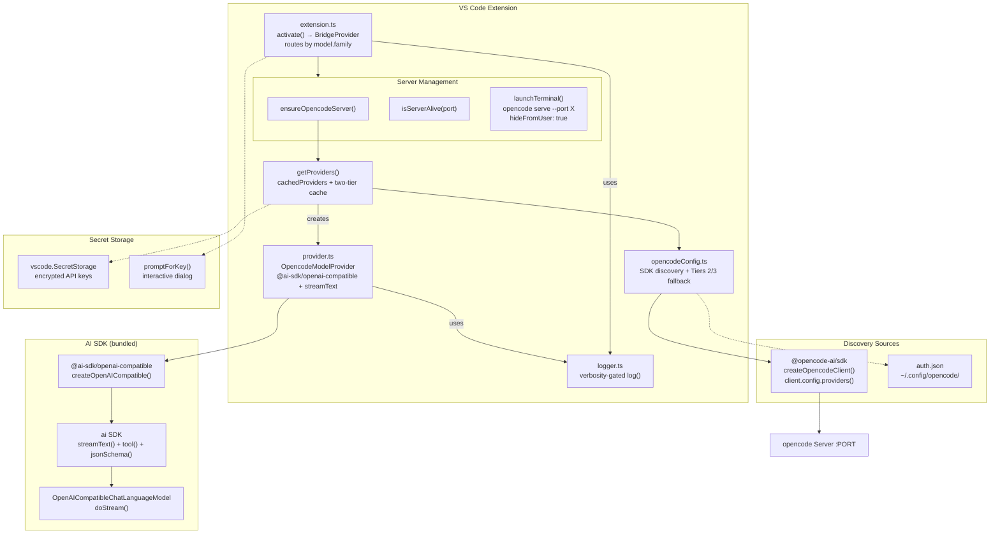
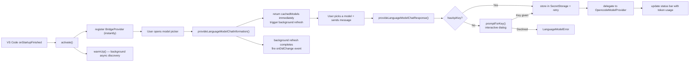

# Architecture — OpenCode Provider Bridge

A VS Code extension that brings all [opencode](https://opencode.ai)-configured AI providers (Anthropic, OpenAI, Google, NVIDIA, Vultr, Zen, Go, etc.) into VS Code's Chat model picker so you can use them alongside GitHub Copilot or as your primary chat models. Uses `@ai-sdk/openai-compatible` under the hood for reliable OpenAI-compatible API calls.



---

## 1. Entry Point — `package.json`

The extension manifest tells VS Code about our extension:

| Field | Purpose |
|---|---|
| `"type": "module"` | ESM — allows direct `import` of `@opencode-ai/sdk` |
| `activationEvents` | `onStartupFinished` — activates shortly after VS Code starts, doesn't block first window |
| `contributes.languageModelChatProviders` | Registers vendor ID `"opencode-provider-bridge"` with `configuration` schema for Manage Models dialog |
| `contributes.configuration` | `logLevel` setting (`error`/`warn`/`info`/`debug`) |
| `contributes.commands` | 4 commands: refresh, status, set key, remove key |
| `dependencies` | `@ai-sdk/openai-compatible`, `@opencode-ai/sdk`, `ai` |

The `languageModelChatProviders` contribution includes a `configuration` schema with an `apiKey` (string, `secret: true`) property. This drives VS Code's **Manage Models** dialog, allowing users to configure API keys through the native UI.

---

## 2. Extension Activation — `src/extension.ts`

**VS Code Lifecycle:**



### Functions & APIs

| Function | Role |
|---|---|
| `activate()` | Registers `BridgeProvider` + 4 commands + status bar; starts background warm-up |
| `deactivate()` | Disposes headless server terminal, clears cache |
| `ensureOpencodeServer()` | Cached port → check :4096 → launch headless terminal |
| `isServerAlive(port)` | Pings `/global/health` endpoint |
| `launchTerminal()` | Runs `opencode serve --port <random>` in hidden terminal |
| `getProviders(context)` | SDK via server → fallback → wrap in `OpencodeModelProvider` |
| `refreshProviderCache(provider)` | Background refresh; fires `onDidChange` only if models actually changed |
| `showStatus()` | Notification with per-provider key status and model counts |

### Commands

| Command | Effect |
|---|---|
| `refreshModels` | Clears cache + server port, fires change event |
| `showStatus` | Shows notification with provider counts and key status |
| `setApiKey` | Lists discovered providers with key status, user picks one and enters key |
| `removeProvider` | Lists only providers with stored keys, user picks one to remove |

---

## 3. BridgeProvider — `src/extension.ts` (class)

The `BridgeProvider` implements `vscode.LanguageModelChatProvider` and acts as a **router**: one provider VS Code sees, delegates to the correct `OpencodeModelProvider` based on `model.family`. Uses a two-tier caching strategy: models are returned instantly from cache while background refresh keeps them up to date.

### VS Code LM Provider API — 3 Required Methods

| Method | Input | Output |
|---|---|---|
| `provideLanguageModelChatInformation()` | `{ silent }` + `CancellationToken` | `LanguageModelChatInformation[]` (instant from cache or awaited first time) |
| `provideLanguageModelChatResponse()` | `model`, `messages[]`, `options` (tools), `progress`, `token` | `void` — streams via `progress.report()` |
| `provideTokenCount()` | `model`, `text`, `token` | `number` — char-based estimation |

### Key Design Decisions

- **Two-tier caching**: Models returned instantly from `cachedModelsList`; background refresh fires `onDidChangeLanguageModelChatInformation` when models change
- **Key prompting on use**: If `!provider.hasApiKey`, show dialog ONLY when user tries to chat — not on startup
- **Token status bar**: After each response, shows `$(hubot) OC 452→123 (575) tok` (abbreviated format)
- **Error classification**: Distinguishes rate limit (429), auth failure (401/403), and quota exceeded (402)
- **Zen/Go key sharing**: If `opencode-go` has no key, uses `opencode` (Zen) key — they share the same API key

---

## 4. Provider Discovery — `src/opencodeConfig.ts`

Two-tier fallback: SDK → models.dev + auth.json → bare fallback. No provider synthesis — only shows what opencode reports.

### Types

| Type | Description |
|---|---|
| `ProviderCredential` | API key or OAuth token |
| `ModelsDevModel` | Model metadata with `apiUrl` (exact endpoint from SDK registry) |
| `ModelsDevProvider` | Provider metadata |
| `ProviderEntry` | Combined: provider + credential + models |

### Tier 1 — SDK Discovery (Preferred)

`trySdkProviders(port?)` calls `createOpencodeClient()` → `client.config.providers()` on the given port. Returns all configured providers with keys, models, capabilities, and exact API URLs.

### Tier 2 — models.dev + auth.json

Fetches the public `models.dev/api.json` catalog and intersects it with credentials from `auth.json` (reads from `~/.local/share/opencode/auth.json`, `~/.opencode/auth.json`, or `~/.config/opencode/auth.json`).

### Tier 3 — Bare Fallback

Every auth.json entry gets one placeholder model with `tool_call: true`.

---

## 5. Per-Provider Implementation — `src/provider.ts`

Each opencode-configured provider gets its own `OpencodeModelProvider` instance. Uses `@ai-sdk/openai-compatible` for the HTTP layer instead of manual fetch/SSE parsing.

### Dependencies

```typescript
import { createOpenAICompatible } from '@ai-sdk/openai-compatible';
import { streamText, tool, jsonSchema } from 'ai';
```

### API Call Flow

1. **Create provider**: `createOpenAICompatible({ name, baseURL, apiKey })` — handles auth headers, URL formatting
2. **Convert messages**: VS Code `LanguageModelChatRequestMessage[]` → AI SDK `ModelMessage[]` via `toModelMessages()`
3. **Build tools**: VS Code `LanguageModelChatTool[]` → AI SDK `ToolSet` via `tool({ inputSchema: jsonSchema(params) })`. Tool schemas are **cached** by name to avoid re-simplification on repeated calls.
4. **Stream**: `streamText({ model, messages, tools, toolChoice })` — SDK manages HTTP, streaming, tool call accumulation
5. **Emit parts**: Iterate `fullStream` and map each event to the corresponding VS Code response part

### Full Stream Event Mapping

| `fullStream` Event | VS Code Response Part | Description |
|---|---|---|
| `text-delta` | `LanguageModelTextPart` | Streams output text token by token |
| `reasoning-delta` | `LanguageModelThinkingPart` | Streams thinking/reasoning content in real-time |
| `reasoning-start` | `LanguageModelThinkingPart('')` | Triggers the thinking animation in chat UI |
| `reasoning-end` | `LanguageModelThinkingPart` with `vscode_reasoning_done: true` | Closes the thinking animation |
| `tool-call` | `LanguageModelToolCallPart` | Reports a completed tool invocation |
| `tool-result` | `LanguageModelToolResultPart` | Renders tool execution output in chat |
| `finish` | (usage stored in `lastUsage`) | Captures prompt/completion token counts |
| `error` | `LanguageModelError` (classified) | Rate limit, auth, quota, or generic error |
| **Post-stream** | `LanguageModelDataPart` | Reports final aggregated reasoning + usage data |

### Schema Simplification

`simplifySchema()` strips advanced JSON Schema features (`$ref`, `allOf`, `propertyNames`, `patternProperties`, etc.) that some providers reject. Keeps: `type`, `properties`, `items`, `required`, `description`, `enum`, `format`, `additionalProperties`, `anyOf`, `oneOf`, `allOf`, `$ref`, `not`, `title`, `examples`, `pattern`.

### Error Classification

| Condition | Error Type | User Message |
|---|---|---|
| HTTP 429, "rate limit", "too many" | `LanguageModelError.Blocked` | Provider: rate limited — wait and retry |
| HTTP 401/403, "unauthorized", "invalid api key" | `LanguageModelError.NotFound` | Provider: invalid API key — update via Set API Key command |
| HTTP 402, "quota", "insufficient_quota" | `LanguageModelError` (generic) | Provider: quota exceeded — check billing |
| Everything else | `LanguageModelError` (generic) | Provider: request failed — <message> |

### Message Conversion

`toModelMessages()` handles:

| VS Code Part | AI SDK Format |
|---|---|
| `LanguageModelTextPart` | `{ role: 'user'/'assistant', content: string }` |
| `LanguageModelToolCallPart` | `{ type: 'tool-call', toolCallId, toolName, input }` in assistant content array |
| `LanguageModelToolResultPart` | `{ role: 'tool', content: [{ type: 'tool-result', ... }] }` |
| `LanguageModelThinkingPart` | `{ type: 'reasoning', text }` in assistant content array |
| `LanguageModelDataPart` (reasoning) | Accumulated into reasoning content string |

---

## 6. BYOK Provider Parity

The implementation has been verified against VS Code's official BYOK providers (Anthropic, Gemini) and the built-in `CopilotLanguageModelWrapper`. The stream event mapping is **at parity** — every event type exposed by the AI SDK's `fullStream` is correctly mapped to the corresponding VS Code response part.

| Feature | OpenCode Bridge | Anthropic BYOK | Gemini BYOK | Copilot Built-in |
|---|---|---|---|---|
| Text streaming | ✅ `LanguageModelTextPart` | ✅ Same | ✅ Same | ✅ Same |
| Real-time thinking | ✅ Per-delta `LanguageModelThinkingPart` | ✅ Per `thinking_delta` | ✅ Per `thought` part | ✅ Via `delta.thinking` |
| Thinking boundary | ✅ `reasoning-start` + `reasoning-end` | ✅ Via pending thinking state | ✅ Via `thoughtSignature` | ✅ Via `thinkingActive` flag |
| Tool call reporting | ✅ `LanguageModelToolCallPart` | ✅ Same | ✅ Same | ✅ Same |
| Tool result rendering | ✅ `LanguageModelToolResultPart` | ✅ Same | ✅ Same | ✅ Via internal deltas |
| Token usage | ✅ `LanguageModelDataPart('usage')` | ✅ Same | ✅ Same | ✅ Same |
| Error classification | ✅ Rate / Auth / Quota / Generic | ✅ Via internal framework | ✅ Same | ✅ Via `ChatFetchResponseType` |
| Tool schema caching | ✅ Per-name cache | ✅ Built-in token counting | ✅ Built-in | ✅ Built-in |

---

## 7. Optimizations

| Optimization | Description |
|---|---|
| **Two-tier model cache** | Models returned instantly from `cachedModelsList`; background refresh fires `onDidChange` only if models changed |
| **Tool schema cache** | `simplifySchema()` results cached by tool name via `toolSchemaCache` Map — re-used across requests |
| **Local reasoning variable** | `currentReasoning` is a local `let` in `provideLanguageModelChatResponse`, not a class field — no cross-request state leaks |
| **Reasoning-end dedup** | When `reasoning-end` already emitted `vscode_reasoning_done`, final reasoning flush uses `LanguageModelDataPart` instead of duplicating the UI close signal |
| `LanguageModelThinkingPart` | `{ type: 'reasoning', text }` in assistant content array |
| `LanguageModelDataPart` (reasoning MIME) | Accumulated into `reasoning` content |
| `LanguageModelChatMessageRole.System` | `{ role: 'system', content }` (VS Code 1.119+ experimental) |

---

## 6. Logger — `src/logger.ts`

Single `log(msg, level)` function with verbosity gating:

| Level | Shown when setting is |
|---|---|
| `error` | `error` or higher |
| `warn` | `warn` or higher |
| `info` (default) | `info` or higher |
| `debug` | always |

Setting: `"opencode-provider-bridge.logLevel"` in VS Code settings.

---

## 7. Server Management

The extension manages the opencode server lifecycle:

### Port Discovery

```
ensureOpencodeServer()
  ├─ serverPort cached? ─Yes→ isServerAlive() → return port
  │                             ↓ dead → clear cache
  ├─ Check :4096 ────Alive→ cache + return
  └─ Launch headless ──→ opencode serve --port <random>
                          └─ hideFromUser: true (no terminal tab)
                          └─ Wait up to 15s for /global/health
                          └─ cache + return
```

### Cleanup

| Event | Action |
|---|---|
| Extension deactivates | `serverTerminal.dispose()` kills the process |
| Refresh Models | `serverPort = null` forces re-check |

---

## 8. Secret Storage & Key Management

### Storage

API keys are stored in `vscode.SecretStorage`:
- Key format: `opencode-provider-bridge.key.{providerId}`
- Encrypted at rest by VS Code
- Survives extension reloads

### Retrieval priority

```
SecretStorage → SDK-provided key → auth.json key → empty string
```

Users set keys via the `setApiKey` command, which shows only **discovered** providers with their key status.

### Zen/Go sharing

`opencode` (Zen) and `opencode-go` (Go) share the same API key from opencode.ai. If one has a key stored under its provider ID, the other falls back to it.

---

## 9. VS Code Response Stream Processing

This section documents how VS Code's Copilot Chat extension processes the chunks we report via `progress.report()` in `provideLanguageModelChatResponse()`. Based on the actual VS Code source at `extensions/copilot/src/platform/endpoint/vscode-node/extChatEndpoint.ts` and `https://github.com/microsoft/vscode-copilot`.

### Stream chunk handling

| Chunk type | What VS Code does |
|---|---|
| `LanguageModelTextPart` | Appended to response `text`. Persisted in conversation history as assistant `content` |
| `LanguageModelToolCallPart` | Forwarded to agent loop as `copilotToolCalls[]`. Tool is executed by VS Code |
| `LanguageModelDataPart` with mime `'usage'` | Parsed as `APIUsage`. Populates context window widget (VS Code 1.120+) |
| `LanguageModelDataPart` with other mime | Stripped from conversation history by Copilot Chat |
| `LanguageModelThinkingPart` | Forwarded as `thinking` object. Rendered in Chat UI with collapse/expand |

### Response shapes returned to Copilot Chat

- **Success** — `{ type: 'success', text, usage, resolvedModel }` — requires text or tool calls
- **Unknown** — `{ type: 'unknown', reason, requestId }` — when response is empty
- **Failed** — `{ type: 'failed', reason, requestId }` — when exception is thrown

### Integration Points

| Feature | Mechanism |
|---|---|
| Tool calling | `LanguageModelToolCallPart(callId, name, input)` — streamed from `fullStream` `tool-call` events |
| Reasoning/thinking | `LanguageModelThinkingPart(value, id, metadata)` — accumulated from `reasoning-delta` events |
| Token usage | `LanguageModelDataPart(uint8Array, 'usage')` — from `finish` event's `totalUsage` |
| Message history | Tool results arrive wrapped in `User`-role messages as `LanguageModelToolResultPart` |
| Empty responses | Guard reports zero-length `LanguageModelTextPart('')` to prevent `Unknown` response type |

---

## 10. External Dependencies

| Package | Role |
|---|---|
| `@opencode-ai/sdk` v1.14+ | OpenCode client SDK for provider discovery |
| `@ai-sdk/openai-compatible` v2.0+ | OpenAI-compatible HTTP provider (message conversion, tool formatting, streaming) |
| `ai` v6.0+ | AI SDK core (`streamText`, `tool`, `jsonSchema`) |
| `@types/vscode` | VS Code API types |
| `vscode` namespace | Runtime API (extension host injection) |

---

## 11. File Layout

```
opencode-provider-bridge/
├── package.json           — type:module, activation, 4 commands, logLevel setting
├── tsconfig.json          — module: node16, strict: true
├── README.md              — Marketplace listing
├── ARCHITECTURE.md        — This file
└── src/
    ├── extension.ts       — Entry point, activation, BridgeProvider, server mgmt, key management
    ├── opencodeConfig.ts  — 3-tier provider discovery (SDK → catalog → fallback)
    ├── provider.ts        — Per-provider API calls via @ai-sdk/openai-compatible + streamText
    └── logger.ts          — Verbosity-gated logging (error/warn/info/debug)
```
