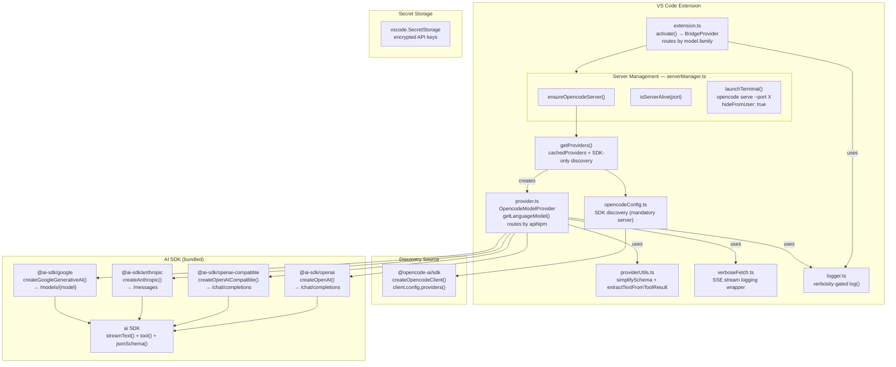
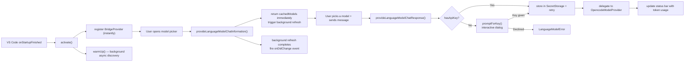

# Architecture — OpenCode Provider Bridge

A VS Code extension that brings all [opencode](https://opencode.ai)-configured AI providers (Anthropic, OpenAI, Google, NVIDIA, Vultr, Zen, Go, etc.) into VS Code's Chat model picker so you can use them alongside GitHub Copilot or as your primary chat models.

Uses multiple Vercel AI SDK packages (`@ai-sdk/openai`, `@ai-sdk/openai-compatible`, `@ai-sdk/anthropic`, `@ai-sdk/google`) under the hood, automatically selecting the correct SDK per model based on the opencode provider registry metadata (`apiNpm`).


```mermaid
flowchart TB
    subgraph VSCode["VS Code Extension"]
        direction TB
        ext["extension.ts<br/>activate() → BridgeProvider<br/>routes by model.family"]

        subgraph ServerMgmt["Server Management — serverManager.ts"]
            ensure["ensureOpencodeServer()"]
            alive["isServerAlive(port)"]
            launch["launchTerminal()<br/>opencode serve --port X<br/>hideFromUser: true"]
        end

        cache["getProviders()<br/>cachedProviders + SDK-only discovery"]
        config["opencodeConfig.ts<br/>SDK discovery (mandatory server)"]
        prov["provider.ts<br/>OpencodeModelProvider<br/>getLanguageModel() routes by apiNpm"]
        utils["providerUtils.ts<br/>simplifySchema + extractTextFromToolResult"]
        verbose["verboseFetch.ts<br/>SSE stream logging wrapper"]
        logger["logger.ts<br/>verbosity-gated log()"]

        ext --> ServerMgmt
        ensure --> cache
        cache --> config
        cache --creates--> prov
        ext --uses--> logger
        prov --uses--> logger
        prov --uses--> utils
        prov --uses--> verbose
    end

    subgraph Discovery["Discovery Source"]
        sdk["@opencode-ai/sdk<br/>createOpencodeClient()<br/>client.config.providers()"]
    end

    subgraph Execution["AI SDK (bundled)"]
        direction TB
        oai["@ai-sdk/openai<br/>createOpenAI()<br/>→ /chat/completions"]
        oaic["@ai-sdk/openai-compatible<br/>createOpenAICompatible()<br/>→ /chat/completions"]
        anth["@ai-sdk/anthropic<br/>createAnthropic()<br/>→ /messages"]
        google["@ai-sdk/google<br/>createGoogleGenerativeAI()<br/>→ /models/{model}"]
        ai["ai SDK<br/>streamText() + tool() + jsonSchema()"]
    end

    subgraph Secrets["Secret Storage"]
        ss["vscode.SecretStorage<br/>encrypted API keys"]
    end

    config --> sdk
    prov --> oai
    prov --> oaic
    prov --> anth
    prov --> google
    oai --> ai
    oaic --> ai
    anth --> ai
    google --> ai
```

---

## 1. Entry Point — `package.json`

The extension manifest tells VS Code about our extension:

| Field | Purpose |
|---|---|
| `"type": "module"` | ESM — allows direct `import` of `@opencode-ai/sdk` |
| `activationEvents` | `onStartupFinished` — activates shortly after VS Code starts, doesn't block first window |
| `contributes.languageModelChatProviders` | Registers vendor ID `"opencode-provider-bridge"` with `configuration` schema for Manage Models dialog |
| `contributes.configuration` | `logLevel` setting (`error`/`warn`/`info`/`debug`) |
| `contributes.commands` | 4 commands: refresh, status, set key, remove key |
| `dependencies` | `@ai-sdk/openai`, `@ai-sdk/openai-compatible`, `@opencode-ai/sdk`, `ai` |

The `languageModelChatProviders` contribution includes a `configuration` schema with an `apiKey` (string, `secret: true`) property. This drives VS Code's **Manage Models** dialog, allowing users to configure API keys through the native UI.

---

## 2. Extension Activation — `src/extension.ts`

**VS Code Lifecycle:**


```mermaid
flowchart LR
    A["VS Code onStartupFinished"] --> B["activate()"]
    B --> C["register BridgeProvider (instantly)"]
    B --> D["warmUp() — background async discovery"]
    C --> E["User opens model picker"]
    E --> F["provideLanguageModelChatInformation()"]
    F --> G["return cachedModels immediately<br/>trigger background refresh"]
    F --> H["background refresh completes<br/>fire onDidChange event"]
    G --> I["User picks a model + sends message"]
    I --> J["provideLanguageModelChatResponse()"]
    J --> K{"hasApiKey?"}
    K -->|No| L["promptForKey()<br/>interactive dialog"]
    L -->|Key given| M["store in SecretStorage + retry"]
    L -->|Declined| N["LanguageModelError"]
    K -->|Yes| M
    M --> O["delegate to OpencodeModelProvider"]
    O --> P["update status bar with token usage"]
```

### Functions & APIs

| Function | Role |
|---|---|
| `activate()` | Registers `BridgeProvider` + 4 commands + status bar; starts background warm-up |
| `deactivate()` | Disposes headless server terminal (via `disposeServer()`), clears cache |
| `getProviders(context)` | SDK via server (mandatory) → wrap in `OpencodeModelProvider`; empty when server unavailable |
| `refreshProviderCache(provider)` | Background refresh; fires `onDidChange` only if models actually changed |
| `showStatus()` | Notification with per-provider key status and model counts |

Server lifecycle functions (`ensureOpencodeServer()`, `isServerAlive(port)`,
`launchTerminal()`, `isOpencodeCliAvailable()`, `resetServerState()`,
`disposeServer()`) live in [`serverManager.ts`](#9-server-management).

### Commands

| Command | Effect |
|---|---|
| `refreshModels` | Clears cache + server port, fires change event |
| `showStatus` | Shows notification with provider counts and key status |
| `setApiKey` | Lists discovered providers with key status, user picks one and enters key |
| `removeProvider` | Lists only providers with stored keys, user picks one to remove |

---

## 3. BridgeProvider — `src/extension.ts` (class)

The `BridgeProvider` implements `vscode.LanguageModelChatProvider` and acts as a **router**: one provider VS Code sees, delegates to the correct `OpencodeModelProvider` based on `model.family`. Uses a two-tier caching strategy: models are returned instantly from cache while background refresh keeps them up to date.

### VS Code LM Provider API — 3 Required Methods

| Method | Input | Output |
|---|---|---|
| `provideLanguageModelChatInformation()` | `{ silent }` + `CancellationToken` | `LanguageModelChatInformation[]` (instant from cache or awaited first time) |
| `provideLanguageModelChatResponse()` | `model`, `messages[]`, `options` (tools), `progress`, `token` | `void` — streams via `progress.report()` |
| `provideTokenCount()` | `model`, `text`, `token` | `number` — char-based estimation |

### Key Design Decisions

- **Two-tier caching**: Models returned instantly from `cachedModelsList`; background refresh fires `onDidChangeLanguageModelChatInformation` when models change
- **Key prompting on use**: If `!provider.hasApiKey`, show dialog ONLY when user tries to chat — not on startup
- **Token status bar**: After each response, shows `$(hubot) OC 452→123 (575) tok` (abbreviated format)
- **Error classification**: Distinguishes rate limit (429), auth failure (401/403), and quota exceeded (402)
- **Zen/Go key sharing**: If `opencode-go` has no key, uses `opencode` (Zen) key — they share the same API key

---

## 4. Provider Discovery — `src/opencodeConfig.ts`
The opencode SDK returns per-model metadata with `api.url` (the exact API endpoint for that model) and `api.npm` (the AI SDK package to use for that model). This is used by `provider.ts` for SDK routing.

### SDK-Only Discovery (mandatory server)

The opencode server is the single source of truth. `trySdkProviders(port?)` calls `createOpencodeClient()` → `client.config.providers()` on the given port and returns all configured providers with keys, models, capabilities, and exact API URLs. There is **no** models.dev or auth.json fallback — if the server is unavailable, discovery returns an empty map and `serverManager.ts` shows a retryable error popup.

### Types

| Type | Description |
|---|---|
| `ProviderCredential` | API key or OAuth token |
| `ModelsDevModel` | Model metadata with `apiUrl` (exact endpoint from SDK registry) |
| `ModelsDevProvider` | Provider metadata |
| `ProviderEntry` | Combined: provider + credential + models |

---

## 5. Per-Provider Implementation — `src/provider.ts`

Each opencode-configured provider gets its own `OpencodeModelProvider` instance.
Uses multiple AI SDK packages (`@ai-sdk/openai`, `@ai-sdk/openai-compatible`,
`@ai-sdk/anthropic`, `@ai-sdk/google`) with auto-routing via `getLanguageModel()`
based on per-model `apiNpm` metadata from the opencode provider registry.

### Dependencies

```typescript
import { createOpenAI } from '@ai-sdk/openai';
import { createOpenAICompatible } from '@ai-sdk/openai-compatible';
import { createAnthropic } from '@ai-sdk/anthropic';
import { createGoogleGenerativeAI } from '@ai-sdk/google';
import { streamText, tool, jsonSchema } from 'ai';
import { simplifySchema, extractTextFromToolResult } from './providerUtils.js';
import { createVerboseFetch } from './verboseFetch.js';
```

### SDK Routing (`getLanguageModel()`)

Routes each model to the correct AI SDK based on `apiNpm` from opencode registry:

| `apiNpm` | SDK | Auth Header | Endpoint |
|---|---|---|---|
| `@ai-sdk/openai` | `createOpenAI()` | `Authorization: Bearer` | `/chat/completions` |
| `@ai-sdk/openai-compatible` | `createOpenAICompatible()` | `Authorization: Bearer` | `/chat/completions` |
| `@ai-sdk/anthropic` | `createAnthropic()` | `Authorization: Bearer` | `/messages` |
| `@ai-sdk/google` | `createGoogleGenerativeAI()` | `x-goog-api-key` | `/models/{modelId}` |
| unknown / not set | `createOpenAICompatible()` (default) | `Authorization: Bearer` | `/chat/completions` |

Each SDK provider is cached as a class field and lazily created on first use.
All providers are re-created when `setApiKey()` is called.

### API Call Flow

1. **Select SDK**: `getLanguageModel(modelId)` routes by `apiNpm`, returns `LanguageModelV3`
2. **Convert messages**: VS Code `LanguageModelChatRequestMessage[]` → AI SDK `ModelMessage[]` via `toModelMessages()`
3. **Build tools**: VS Code `LanguageModelChatTool[]` → AI SDK `ToolSet` via `tool({ inputSchema: jsonSchema(params) })`. Tool schemas are **cached** by name in `toolSchemaCache` to avoid re-simplification.
4. **Stream**: `streamText({ model: languageModel, messages, tools, toolChoice })` — SDK manages HTTP, streaming, tool call accumulation
5. **Emit parts**: Iterate `fullStream` and map each event to the corresponding VS Code response part

### Model Configuration

Models advertise a `configurationSchema` (built in `opencodeConfig.ts`:
`buildModelConfigSchema()`) with up to four controls:

| Property | Group | Source | Default |
|---|---|---|---|
| `reasoningEffort` (Thinking Effort) | `navigation` | opencode per-model `variants` keys | `defaultEffort()` (medium if present, else first non-none) |
| `contextSize` (Context Size) | `tokens` | **only if the model declares `cost.tiers` with `tier.type === "context"`** — sizes = tier sizes ∪ full `limit.context` (when larger); default = tier marked `default: true`, else smallest tier | API-marked tier default |
| `temperature` | — | only if `capabilities.temperature` | 1 |
| `maxOutputTokens` | — | `limit.output` (half, full) | full |

Context Size is **tier-gated**: models without context cost tiers (e.g.
`glm-5.3-flash`, which genuinely supports its full 1M window) get no
Context Size option at all. There is deliberately **no `context − output`
fallback** — that synthesized "input budget" misrepresents models whose
servers declare the full window. Tier `size` values are pricing thresholds,
not exclusive sizes; the full `limit.context` is always unioned in (e.g.
gpt-5.6-luna offers 272K + 1.05M). Token counts are displayed rounded
**down** (`formatTokenCount`: 1,050,000 → "1M", 131,072 → "131K") so labels
never overstate capacity, matching OpenCode's own UI; the underlying enum
value stays exact.

VS Code renders the `navigation`/`tokens` groups in the chat-input model picker;
the other enum properties appear in Manage Models → Configure. The user's picks
arrive in `provideLanguageModelChatResponse` as `options.modelConfiguration.*`
and are forwarded by `buildProviderOptions()`:

- **Reasoning**: the selected opencode `variant` value is spread 1:1 into the
  SDK's provider options (`openaiCompatible`/`anthropic`/`google`) — opencode
  uses the same AI SDKs internally, so no translation is needed.
- **Context size**: forwarded as `openaiCompatible.contextSize` only when a
  smaller-than-full window is picked; skipped for anthropic/google.
- **Temperature / Max Output Tokens**: forwarded as top-level `streamText` options.

### Tool Name Resolution

`LanguageModelToolResultPart` has **no `.name` property** in VS Code's API (confirmed
against the built-in BYOK providers). The extension uses a `toolCallNameCache`
(`Map<toolCallId, toolName>`) populated when `ToolCallPart` is processed and
looked up when `ToolResultPart` is processed. This works because `toModelMessages()`
processes all messages in chronological order — assistant messages (with tool calls)
always precede user messages (with tool results).

### Verbose Fetch Wrapper

The `createVerboseFetch()` function from `verboseFetch.ts` wraps `globalThis.fetch`
and intercepts SSE streaming responses at debug log level:
- HTTP method + URL
- Request body (truncated to 2KB)
- Response status + content-type
- Each SSE event's `data:` line (truncated to 500 chars per line) with event counter
- Stream end notification with total event count

Set `opencode-provider-bridge.logLevel` to `debug` to enable.

### Full Stream Event Mapping

| `fullStream` Event | VS Code Response Part | Description |
|---|---|---|
| `text-delta` | `LanguageModelTextPart` | Streams output text token by token |
| `reasoning-delta` | `LanguageModelThinkingPart` | Streams thinking/reasoning content in real-time |
| `reasoning-start` | `LanguageModelThinkingPart('')` | Triggers the thinking animation in chat UI |
| `reasoning-end` | `LanguageModelThinkingPart` with `vscode_reasoning_done: true` | Closes the thinking animation |
| `tool-call` | `LanguageModelToolCallPart` | Reports a completed tool invocation |
| `tool-result` | `LanguageModelToolResultPart` | Renders tool execution output in chat |
| `finish` | (usage stored in `lastUsage`) | Captures prompt/completion token counts |
| `error` | `LanguageModelError` (classified) | Rate limit, auth, quota, or generic error |
| **Post-stream** | `LanguageModelDataPart` | Reports final aggregated reasoning + usage data |

### Schema Simplification

`simplifySchema()` (in `providerUtils.ts`) strips advanced JSON Schema features that some providers reject. Keeps: `type`, `properties`, `items`, `required`, `description`, `enum`, `format`, `default`, `additionalProperties`, `anyOf`, `oneOf`, `allOf`, `$ref`, `not`, `title`, `examples`, `pattern`, `minimum`, `maximum`, `minLength`, `maxLength`, `minItems`, `maxItems`.

### Error Classification

| Condition | Error Type | User Message |
|---|---|---|
| HTTP 429, "rate limit", "too many" | `LanguageModelError.Blocked` | Provider: rate limited — wait and retry |
| HTTP 401/403, "unauthorized", "invalid api key" | `LanguageModelError.NotFound` | Provider: invalid API key — update via Set API Key command |
| HTTP 402, "quota", "insufficient_quota" | `LanguageModelError` (generic) | Provider: quota exceeded — check billing |
| Everything else | `LanguageModelError` (generic) | Provider: request failed — <message> |

### Message Conversion

`toModelMessages()` handles:

| VS Code Part | AI SDK Format |
|---|---|
| `LanguageModelTextPart` | `{ role: 'user'/'assistant', content: string }` |
| `LanguageModelToolCallPart` | `{ type: 'tool-call', toolCallId, toolName, input }` in assistant content array |
| `LanguageModelToolResultPart` | `{ role: 'tool', content: [{ type: 'tool-result', toolCallId, toolName, output }] }` |
| `LanguageModelThinkingPart` | `{ type: 'reasoning', text }` in assistant content array |
| `LanguageModelDataPart` (reasoning MIME) | Accumulated into `reasoning` content string |
| `LanguageModelChatMessageRole.System` | `{ role: 'system', content }` |
| ToolResultPart name resolution | Looked up from `toolCallNameCache` by `callId`, warns on miss |

---

## 6. BYOK Provider Parity

The implementation has been verified against VS Code's official BYOK providers (Anthropic, Gemini) and the built-in `CopilotLanguageModelWrapper`. The stream event mapping is **at parity** — every event type exposed by the AI SDK's `fullStream` is correctly mapped to the corresponding VS Code response part.

| Feature | OpenCode Bridge | Anthropic BYOK | Gemini BYOK | Copilot Built-in |
|---|---|---|---|---|
| Text streaming | ✅ `LanguageModelTextPart` | ✅ Same | ✅ Same | ✅ Same |
| Real-time thinking | ✅ Per-delta `LanguageModelThinkingPart` | ✅ Per `thinking_delta` | ✅ Per `thought` part | ✅ Via `delta.thinking` |
| Thinking boundary | ✅ `reasoning-start` + `reasoning-end` | ✅ Via pending thinking state | ✅ Via `thoughtSignature` | ✅ Via `thinkingActive` flag |
| Tool call reporting | ✅ `LanguageModelToolCallPart` | ✅ Same | ✅ Same | ✅ Same |
| Tool result rendering | ✅ `LanguageModelToolResultPart` | ✅ Same | ✅ Same | ✅ Via internal deltas |
| Token usage | ✅ `LanguageModelDataPart('usage')` via `buildUsagePayload()` (includes cached + reasoning details) | ✅ Same | ✅ Same | ✅ Same |
| Error classification | ✅ Rate / Auth / Quota / Generic | ✅ Via internal framework | ✅ Same | ✅ Via `ChatFetchResponseType` |
| Tool schema caching | ✅ Per-name cache | ✅ Built-in token counting | ✅ Built-in | ✅ Built-in |

---

## 7. Optimizations

| Optimization | Description |
|---|---|
| **Two-tier model cache** | Models returned instantly from `cachedModelsList`; background refresh fires `onDidChange` only if models changed |
| **Tool schema cache** | `simplifySchema()` results cached by tool name via `toolSchemaCache` Map — re-used across requests |
| **Tool name cache** | `toolCallNameCache` maps toolCallId → toolName for ToolResultPart resolution across turns |
| **Local reasoning variable** | `currentReasoning` is a local `let` in `provideLanguageModelChatResponse`, not a class field — no cross-request state leaks |
| **Reasoning-end dedup** | When `reasoning-end` already emitted `vscode_reasoning_done`, final reasoning flush uses `LanguageModelDataPart` instead of duplicating the UI close signal |
| **Minimal text empty guard** | If stream produced no text, no tool calls, and no reasoning, emits a minimal `LanguageModelTextPart('')` to prevent Copilot "Unknown error" |

---

## 8. Logger — `src/logger.ts`

Single `log(msg, level)` function with verbosity gating:

| Level | Shown when setting is |
|---|---|
| `error` | `error` or higher |
| `warn` | `warn` or higher |
| `info` (default) | `info` or higher |
| `debug` | always |

Setting: `"opencode-provider-bridge.logLevel"` in VS Code settings.

**Extension Development Host override:** when
`context.extensionMode === vscode.ExtensionMode.Development` (F5 debug
session), the threshold is forced to `debug` and the output channel is
shown automatically at activation — no setting change needed while
debugging. Detection uses the official `extensionMode` API (the
`vscode.env.machineId` sentinel approach is unreliable in current builds).

---

## 9. Token Usage Reporting — `src/languageModelUsage.ts`

The usage payload reported to Copilot is a typed, single-sourced contract:

- `LanguageModelUsagePayload` — OpenAI-style shape. `prompt_tokens`,
  `completion_tokens`, `total_tokens` MUST be numbers or Copilot's
  `isApiUsage()` validation drops the part.
- `buildUsagePayload()` — builds the payload, omitting empty detail
  sections (`prompt_tokens_details.cached_tokens`,
  `completion_tokens_details.reasoning_tokens`).

Downstream chain (verified in `microsoft/vscode` main):
`extChatEndpoint.ts` parses the part → `toolCallingLoop.ts` forwards
`stream.usage()` → `chatContextUsageWidget` / Session-Info-style popup.

Diagnostics: `USAGE finish prompt=… completion=…` at debug level; a warn
is logged when the provider returns no counts (including the raw
`usage`/`totalUsage` payloads). Note the per-response "Response details"
footer requires `modelTotals` (agent-host sessions only) and is not
reachable from third-party providers.

---

## 9. Server Management

Server lifecycle lives in `src/serverManager.ts`, which owns the opencode
server lifecycle (port discovery, headless start, CLI check, startup error
popup, terminal disposal).

### Port Discovery

```
ensureOpencodeServer(onRetry?)
  ├─ serverPort cached? ─Yes→ isServerAlive() → return port
  │                             ↓ dead → clear cache
  ├─ Check :4096 ────Alive→ cache + return
  ├─ opencode CLI on PATH? ─No→ error popup ("Retry" / "Get OpenCode") + return null
  │                                        └─ server is mandatory — no models.dev fallback
  └─ Launch headless ──→ opencode serve --port <random>
                          └─ hideFromUser: true (no terminal tab)
                          └─ Wait up to 15s for /global/health
                          └─ alive → cache + return
                          └─ timeout → error popup ("Retry" / "Get OpenCode") + return null
```

"Retry" re-runs discovery (via the `onRetry` callback wired in `extension.ts:getProviders()`), so the extension can continue loading normally once opencode is set up. The popup is shown at most once per session; it is re-armed by a successful connection, the Refresh Models command, or pressing Retry.

### Cleanup

| Event | Action |
|---|---|
| Extension deactivates | `disposeServer()` → `serverTerminal.dispose()` kills the process |
| Refresh Models | `resetServerState()` → `serverPort = null` forces re-check; resets the once-per-session startup-error popup |

---

## 10. Secret Storage & Key Management

### Storage

API keys are stored in `vscode.SecretStorage`:
- Key format: `opencode-provider-bridge.key.{providerId}`
- Encrypted at rest by VS Code
- Survives extension reloads

### Retrieval priority

```
SecretStorage → SDK-provided key → empty string
```

Users set keys via the `setApiKey` command, which shows only **discovered** providers with their key status.

### Zen/Go sharing

`opencode` (Zen) and `opencode-go` (Go) share the same API key from opencode.ai. If one has a key stored under its provider ID, the other falls back to it.

---

## 9. VS Code Response Stream Processing

This section documents how VS Code's Copilot Chat extension processes the chunks we report via `progress.report()` in `provideLanguageModelChatResponse()`. Based on the actual VS Code source at `extensions/copilot/src/platform/endpoint/vscode-node/extChatEndpoint.ts` and `https://github.com/microsoft/vscode-copilot`.

### Stream chunk handling

| Chunk type | What VS Code does |
|---|---|
| `LanguageModelTextPart` | Appended to response `text`. Persisted in conversation history as assistant `content` |
| `LanguageModelToolCallPart` | Forwarded to agent loop as `copilotToolCalls[]`. Tool is executed by VS Code |
| `LanguageModelDataPart` with mime `'usage'` | Parsed as `APIUsage`. Populates context window widget (VS Code 1.120+) |
| `LanguageModelDataPart` with other mime | Stripped from conversation history by Copilot Chat |
| `LanguageModelThinkingPart` | Forwarded as `thinking` object. Rendered in Chat UI with collapse/expand |

### Zen reasoning round trip

OpenCode Zen thinking models return `reasoning_content` through the
OpenAI-compatible SSE stream. AI SDK exposes it as `reasoning-delta`; the
bridge streams those deltas to the UI, then emits one terminal
`LanguageModelThinkingPart` with `metadata._completeThinking`. That metadata is
the history-safe completed value; custom `LanguageModelDataPart` values are
stripped before the next provider request.

On a subsequent turn, `toModelMessages()` prefers `_completeThinking` over
streamed deltas to prevent duplication. It converts the restored value to an AI
SDK assistant `{ type: 'reasoning', text }` part. In the pinned
`@ai-sdk/openai-compatible` v2.0.47, that part becomes
`assistant.reasoning_content` in the `/chat/completions` request. This is the
provider-specific value Zen requires; no empty fallback is emitted.

Debug logs report only reasoning presence and length at SSE, history, model
message, and HTTP serialization boundaries. They never include reasoning text,
request text, or API keys.

### Response shapes returned to Copilot Chat

- **Success** — `{ type: 'success', text, usage, resolvedModel }` — requires text or tool calls
- **Unknown** — `{ type: 'unknown', reason, requestId }` — when response is empty
- **Failed** — `{ type: 'failed', reason, requestId }` — when exception is thrown

### Integration Points

| Feature | Mechanism |
|---|---|
| Tool calling | `LanguageModelToolCallPart(callId, name, input)` — streamed from `fullStream` `tool-call` events |
| Reasoning/thinking | `LanguageModelThinkingPart(value, id, metadata)` — accumulated from `reasoning-delta` events |
| Token usage | `LanguageModelDataPart(uint8Array, 'usage')` — from `finish` event's `totalUsage` |
| Message history | Tool results arrive wrapped in `User`-role messages as `LanguageModelToolResultPart` |
| Empty responses | Guard reports zero-length `LanguageModelTextPart('')` to prevent `Unknown` response type |

---

## 10. External Dependencies

| Package | Role |
|---|---|
| `@opencode-ai/sdk` v1.14+ | OpenCode client SDK for provider discovery |
| `@ai-sdk/openai` v3.0+ | OpenAI-native HTTP provider (GPT models — required; openai-compatible is rejected by Zen with a 500) |
| `@ai-sdk/openai-compatible` v2.0+ | OpenAI-compatible HTTP provider (message conversion, tool formatting, streaming) |
| `ai` v6.0+ | AI SDK core (`streamText`, `tool`, `jsonSchema`) |
| `@types/vscode` | VS Code API types |
| `vscode` namespace | Runtime API (extension host injection) |

---

## 11. File Layout

```
opencode-provider-bridge/
├── package.json           — type:module, activation, 4 commands, logLevel setting
├── tsconfig.json          — module: node16, strict: true
├── README.md              — Marketplace listing
├── ARCHITECTURE.md        — This file
└── src/
    ├── extension.ts       — Entry point, activation, BridgeProvider, key management
    ├── serverManager.ts   — opencode server lifecycle (find/start CLI, health check, popup)
    ├── opencodeConfig.ts  — SDK-only provider discovery (mandatory opencode server)
    ├── provider.ts        — Per-provider API calls via @ai-sdk/openai + @ai-sdk/openai-compatible + streamText
    └── logger.ts          — Verbosity-gated logging (error/warn/info/debug)
```
